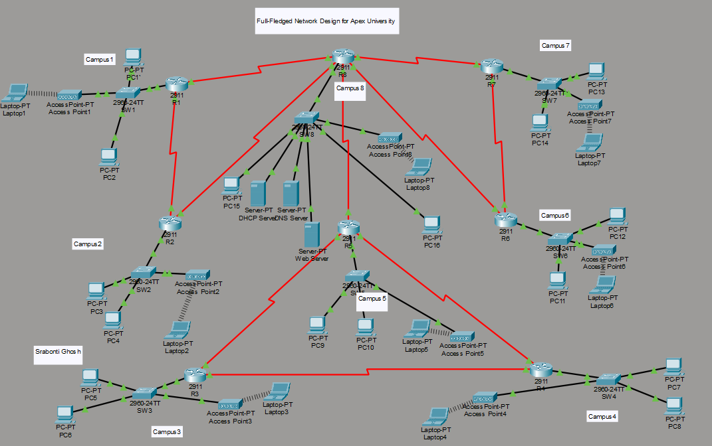

# Apex University Campus Network Design
### CSE405 — Computer Networks Mini Project

## Overview
A complete enterprise network design for Apex University 
with 8 campuses built in Cisco Packet Tracer.

## Network Features
- 8 Campus LANs (wired + wireless)
- 12 Serial WAN Links between routers
- OSPF Dynamic Routing
- Single DHCP Server for all campuses
- DNS Server resolving abc.apex.edu.bd
- University Web Server
- IP addressing using Class A, B and C

## Technologies Used
- Cisco Packet Tracer
- OSPF Routing Protocol
- DHCP / DNS / HTTP Services
- IPv4 Subnetting
- Serial DCE/DTE WAN Links
- Wireless Networking (AP-PT)

## Network Topology

## Website

## OSPF Routing Table

## Files
- ApexUniversity.pkt — Packet Tracer file
- ApexUniversity_Network_Report.docx — Full report
